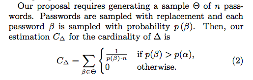
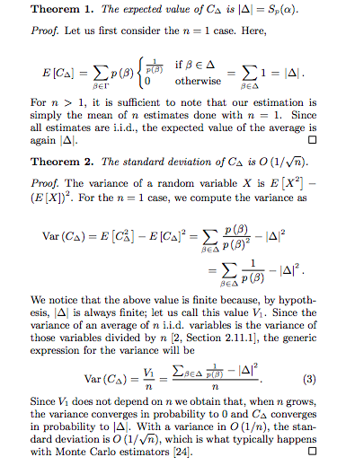

##The clock is still ticking: Timing Attacks in the Modern Web (CCS 2015)

__Basic Timing Attacks:__

* Direct Timing: Direct timing attack is used to measure the state of a website. For example, checking the existence of a username of a website (Does www.example.com/username exist?) by examing the response time of the server.
* Cross-site Timing: Learn the state of a user at a cross-origin website by leveraging javascript to time the cross-origin requests. If a user belongs to a group, then the parsing time (of an wrongly labeled image) should be long (file size is large).

__New Attack Vectors:__
* ==Video Parsing==: HTML5 introduces video and audio elements, which enable the developers to directly encrypt video and sound content in their website. The elements fire events to indicate the the progress of downloading and loading (periodical __progress__ and __suspend__ events). The time (between __suspend__ and __error__ events) to parse the resource is dependent on the size of the resource (so does not rely on the Internet condition).
* ==ApplicationCache==: A recent browser feature named ApplicationCache can be used by the developer to specify which file should be cached permanently. ApplicationCache can override the directives on the server side, allowing an attacker to force an external resource to be cached. The time used to request the cached files can be used as a side-channel to leak information.
* ==Service Workers==: Service Workers is a new feature used to programmably control the cached files. Its lifespan is independent of the page that created it. This daemon-like feature can be used similar to Application Cache but is more reliable. The time of caching and removing a file in the cache can be used to determine the size of the file independent to network conditions.

__Countermeasures__:
Use a SSO style server modification. The server issues a cookie to the client. And when the client requests a file, it must include this cookie. Therefore, in the malicious website, the attacker cannot cache a file by naming the path (pretty like the PathTracker Project)

##Monte Carlo Strength Evaluation: Fast and Reliable Password Checking (CCS 2015)

__Main Idea__: Use sampling to estimate the strength of a password (which is presented by the ranking of the passwords). $\Delta$ is the set of passwords that are weaker than the target password.

</img>

</img>

The probability of the passwords can be computed from state of art techniques such as Markov Model or PCFG. 
